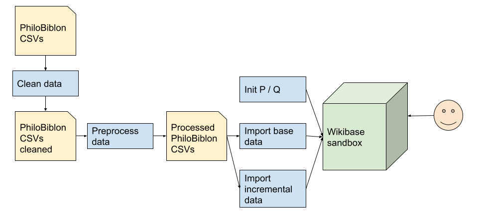

# PhiloBiblon2Wikibase

Migrates base data from PhiloBiblon database to a Wikibase instance.



The diagram above needs some updates:
* Steps 2 and 3 "init P#/Q#", and "import base data" would only be done in a fresh wikibase instance. If you are 
  working with an existing wikibase such as pb.cog, you probably don't need to do these steps.
* During development of the schemas, steps 4 through 7 will be iterated. After step 7, we often learn that there are 
  changes we want to make to the schemas that in turn require changes to the preprocess code (step 4), and/or the 
  OpenRefine schemas (5), and/or the postprocess code (6).

__NOTE__: If you want to create a wikibase instance from scratch, follow [this](https://github.com/PhiloBiblon/philobiblon-to-wikibase/blob/master/philobiblon-sandbox/README.md).

## Setup environment

These steps assume that you are using a Linux OS although it should be similar for other OS.

1. Create a new python virtual environment.
```
virtualenv .env
source .env/bin/activate
pip install -r requirements.txt
```
2. Set parameters in `common/settings.py`, for example:
```
MEDIAWIKI_API_URL = "https://philobiblon.cog.berkeley.edu/w/api.php"
SPARQL_ENDPOINT_URL = "https://philobiblon.cog.berkeley.edu/query/bigdata/namespace/wdq/sparql"
WB_USER = '<changeme>'
WB_PASSWORD = '<changeme>'

RECONCILIATION_ERROR_OBJECT = 'Q51063'
```
__NOTE 1__: It is recommended that you use a bot account on the wikibase. See [here](https://heardlibrary.github.io/digital-scholarship/host/wikidata/bot/) for instructions. However, not all the steps below require a bot -- a personal account can work for some operations. If creating a bot, only `Edit existing pages` and `Create, edit, and move pages` permissions are required. Fill in the `WB_USER` and `WB_PASSWORD` parameters with the account credentials. __Never check credentials into github__. 

__NOTE 2__: The `RECONCILIATION_ERROR_OBJECT` is an object used during pre-processing to indicate errors without breaking quick statements. This setting can't yet be specified if you have an empty wikibase. Look for more information in the pre-processing section below. 

### To be documented

Here are some other environment setup issues that should perhaps be better documented.

* On Macs, managing python versions can be an issue. The documentation and scripts use just `python` not `python3`. 
  One way to manage this is to use `pyenv`. I am using python version 3.9.19, but newer versions probably work fine. 
* The utf-9 cleanup step requires a different version of `iconv` than is present by default on a mac. I had success 
  with `brew install libiconv` followed by putting the brew version forward in the path.
* We saw a problem with pandas and numpy version incompatibility. This was worked around by removing the version 
  specifications in requirements.txt.

## Summary of steps 

The following steps are detailed in separate sections below. You may not need to do all of them.

1. Create supporting properties and q-items  
2. Get the raw data: usually in `../data/raw`
3. Clean the raw data to produce the `../data/clean` dataset
4. Create the PhiloBiblon base objects
5. Create a lookup table
6. Preprocess the clean data to produce the `../data/processed/pre` dataset
7. Create open-refine projects for each csv
8. Use open-refine to create schemas for each project
9. Use open-refine to export each table as quick statements, and put the output in the appropriate directory
10. Postprocess the quick statement files ro produce the `../data/processed/post` dataset
11. Run the post-processed quick-statements files
12. Import the notes as discussion pages using `run_notes.py`

## Create supporting properties and q-items

If using our target wikibase, FactGrid, skip this step. If using an existing wikibase that has already been 
initialized, skip this step.

If starting from a clean, empty wikibase, this step should be done once. Run this command:
```commandline
python run_init.py
```
Note: this step is configured by these files:
   * *Properties*: `conf/p_properties.csv`
   * *Entities*: `conf/q_items.csv`

## Get the raw data

The raw data lives in g-drive. Directions for fetching it are in the philobiblon-private repository: [here](https://github.com/PhiloBiblon/philobiblon-private/blob/master/data/README.md). Those steps will result in populating a `data/raw` directory. After creating the raw dataset, link that directory to `../data` using a command like this:
```commandline
ln -s ../../philobiblon-private/data ..
```

## Clean the raw data

Run this command:
```commandline
bash clean/mkclean.sh
```

This command will populate the `../data/clean` directory.

## Create the PhiloBiblon base objects

This step creates all the base objects (objects that are keys in the csvs) and all dataclip objects. 
This also needs to be done only once, in a clean wikibase.
Important: for FactGrid, we will only create base objects for objects that have not already been marked as 
reconciled by an explicit P476 "PhiloBiblon ID" and language-specific alias. 

Run this command:
```commandline
python run_base_import.py
```

Note the other options available by running `python run_base_import.py --help`
```commandline
usage: run_base_import.py [-h] [--bib BIB] [--skip_existing] [--dry_run]
                          [--sample_size SAMPLE_SIZE] [--table TABLE]

optional arguments:
  -h, --help            show this help message and exit
  --bib BIB             Top-level bib to preprocess. Default: 'BETA'
  --skip_existing       Skip any objects that already exist
  --dry_run             Dry run: do not side-effect the wikibase
  --sample_size SAMPLE_SIZE
                        Specify the sample size as a positive integer
                        (default: 0 means process all)
  --table TABLE         Table to process. Default is process all
```
## Create a lookup table

A lookup table is a mapping that gives the q numbers for all objects created in the [Create the PhiloBiblon base objects](#Create the PhiloBiblon base objects) section above. The lookup table is used during preprocessing to resolve references to base objects and dataclips without using open-refine reconciliation. 

Lookup table creation is not yet completely automated. Follow these steps:
1. Run the lookup query found in the [Sparql Bestiary](https://docs.google.com/spreadsheets/d/1x0rNHCs61eRg86ZW4DmD8eBjSfUjyzh1F-6UpOW2hJA/edit#gid=0). Note that the query is slightly different for different wikibases.
2. Download the result as a csv. Suppose the downloaded file is `/Users/max/Downloads/query.csv`
3. Clean the result and place it in the correct place. For BETA, this is accomplished by this command:
```
cat /Users/max/Downloads/query.csv | sed 's@https://philobiblon.cog.berkeley.edu/entity/@@' > ../data/clean/BETA/lookup.csv
```

## Preprocess the clean data

To preprocess BETA, run this command
```commandline
python run_preprocess.py
```
Note the other options available by running `python run_preprocess.py --help`
```
usage: run_preprocess.py [-h] [--bib BIB] [--table TABLE] [--lookup [LOOKUP]]

optional arguments:
  -h, --help         show this help message and exit
  --bib BIB          Top-level bib to preprocess. Default: 'BETA'
  --table TABLE      Table to process. Default is process all
  --lookup [LOOKUP]  Use a lookup table for q-numbers. Default: 'lookup.csv'
```
where `<table>` can be:
* ANALYTIC
* BIBLIOGRAPHY
* BIOGRAPHY
* COPIES
* GEOGRAPHY
* INSTITUTIONS
* LIBRARY
* MS_ED
* SUBJECT
* UNIFORM_TITLE

## Create OpenRefine projects from the preprocessed data

This step to be executed once preprocessed data has been made available
1. Intall openrefine-client using pip.  Note, openrefine client requires python 2.7.  (pyenv can be used to set python version locally, 2.7.18 used here)
```commandline
python2 -m pip install openrefine-client --user
```
2. Verify $PATH is set in user shell profile.  openrefine-client installed to /.local/bin which may not be in user $PATH.  If needed, add to $PATH.
   Bash example:
   ```commandline
   export PATH="~/.local/bin/:$PATH" && source ~/.bash_profile
   ```
3. From philobiblon-to-wikibase/pb2wb/openrefine directory on local machine, execute the following script processed-to-openrefine.sh.
   Example:```bash processed-to-openrefine.sh``` or ```./processed-to-openrefine.sh```.  Alternate tag can be applied with -t arg.  Example: ```bash processed-to-openrefine.sh -t test-tag```
4. Verify new projects with correct tag have been created in openrefine.
   ```commandline
   openrefine-client --list -H philobiblon.cog.berkeley.edu -P 3333
   ```

## Model the Schemas using OpenRefine, and Create QuickStatements files

TBD

## Run the Postprocessor

* `run_postprocess.py`: Postprocess QS files exported from QuickStatements.
## Alternate Postprocessor Method:
* From pb2wd path, open `postprocess.ipynb` in jupyter.  Adjust tablenames to be processed in section 3 of playbook if needed.
* Execute playbook.  Processed files will be present in ../data/processed/post/BETA/ directory path.

## Run the Postprocessor

## Import QS files to Wikibase using QuickStatements

1. Open [quickstatements link](https://philobiblon.cog.berkeley.edu/qs/#/)
2. From page, click on new batch button
3. Open post processed table to be imported from ../data/processed/post/BETA/ with a text editor (not from terminal).  Copy contents to clipboard.
4. Paste copied contents into batch window on quickstatements page.
5. Click import v1 commands button and review on following page.  If updates are accurate, proceed to click the `run` button to update.
6. Spot validate updated Q items in https://philobiblon.cog.berkeley.edu


## Import the Notes

`run_notes.py`: Import notes to talk page for each Q item.

For a specific table:

`python run_notes.py --table <table>`

## Developer tips

### Run SPARQL query

1. Configure Wikibase connection properties in `common/settings.py` (`MEDIAWIKI_API_URL`, `SPARQL_ENDPOINT_URL`, `WB_USER`, `WB_PASSWORD` and `SPARQL_PREFIX`).

2. Run the query.
```
from common.wb_manager import WBManager

print('Preparing wikibase connection ...')
wb_manager = WBManager()

results = wb_manager.runSparQlQuery("SELECT ?item ?value { ?item wdt:P476 ?value }")

print(len(results))
```

### Run a simple sparql and get all results as a CSV

1. Configure Wikibase connection properties in `common/settings.py` (`MEDIAWIKI_API_URL`, `SPARQL_ENDPOINT_URL`, `WB_USER`, `WB_PASSWORD` and `SPARQL_PREFIX`).

2. Run this script. This example retrieves all items with PBIDs.
```
python util/run_simple_sparql.py --query "SELECT ?item ?value { ?item wdt:P476 ?value }"
```

### Find missing dataclips (if any)

Make a temp directory:
```
mkdir -p tmp
```
Get the pbitems (as above example):
```
python util/run_simple_sparql.py --query "SELECT ?item ?value { ?item wdt:P476 ?value }" > ./tmp/pbitems.csv
```
Extract the pbid only
```
cat ./tmp/pbitems.csv | csvcut -c value | tail +2 | sort > ./tmp/pbitems.txt
```
Remember the column names from the big dataclip
```
head -1 ../data/clean/BETA/dataclips/beta_dataclips.csv > ./tmp/dataclip-columns.txt
```
Get the full dataclips, drop the "Invalid" ones, use join to find the items tbd - put back the column names
```
cat ../data/clean/BETA/dataclips/beta_dataclips.csv  | sed 's/BETA //' | grep -v Invalid | tail +2 | sort | join -v 1 -t , - ./tmp/pbitems.txt  | (cat ./tmp/dataclip-columns.txt; cat -) > ./tmp/dataclips-tbd.csv
```
Massage into the q-items format for `run_init.py`

```
cat ./tmp/dataclips-tbd.csv | csvstack -n lang -g en - | csvstack -n QNUMBER -g '' - | csvsql --query "select QNUMBER, en as LABEL, lang as LANG, code as ALIAS, code as PBID from stdin" - > ./tmp/q_items.csv
```

