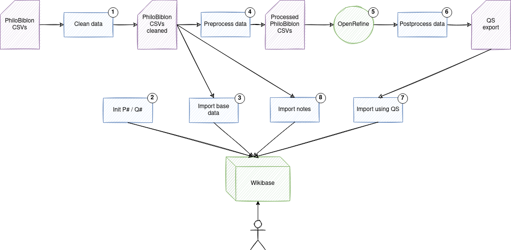

# PhiloBiblon2Wikibase

Migrates base data from PhiloBiblon database to a Wikibase instance.



Next steps assumes that you are using a Linux OS although should be similar for other OS.

## Setup environment

1. Create a new python virtual environment.
```
virtualenv .env
source .env/bin/activate
pip install -r requirements.txt
```
3. Set parameters in `common/settings.py`, for example:
```
MEDIAWIKI_API_URL=http://localhost/api.php
SPARQL_ENDPOINT_URL=http://localhost:8834/sparql
WB_USER=Admin@philobot
WB_PASSWORD=<pass>
```
__NOTE 1__: Create bot credentials to access your wikibase and fill `WB_USER` and `WB_PASSWORD` parameters. Only required `Edit existing pages` and `Create, edit, and move pages` permissions.

__NOTE 2__: If you want to create a wikibase instance from scratch, follow [this](https://github.com/faulhaber/PhiloBiblon/tree/master/philobiblon-sandbox/local).

## Run

Steps to migrate data:
1. `clean/mkclean.sh`: Clean raw CSVs.
2. `run_init.py`: Creates, when not exists, required P and Q Wikibase items using mapping files:
   * *Properties*: `conf/p_properties.csv`
   * *Entities*: `conf/q_items.csv`
3. `run_preprocess.py`: Preprocess raw CSVs.
4. `run_base_import.py`: Import base data from cleaned CSVs to Wikibase.
5. Import preprocessed CSVs to OpenRefine and process them.
6. `run_postprocess.py`: Postprocess QS files exported from QuickStatements.


Commands:

```
source .env/bin/activate
bash clean/mkclean.sh
python run_init.py --first-time
python run_preprocess.py
python run_base_import.py
python run_postprocess.py
```
