# OpenRefine and reconcile demo

Script used in the OpenRefine and reconcile demo.

In this demo we will create a Wikibase suite by adding a reconciliation service to do an example import using OpenRefine.

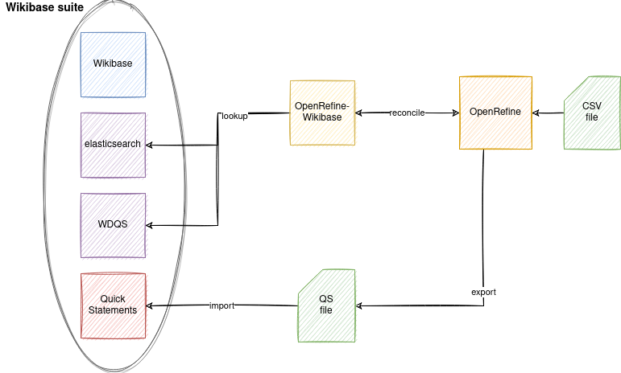

## Requirements

Install these tools:

1. [Docker](https://docs.docker.com/get-docker/)
2. [Docker Compose](https://docs.docker.com/compose/install/)
3. [Python 3](https://www.python.org/downloads/)

## Prepare the environment

Create a Wikibase suite from scratch and import base data for all the items. 

From our project `PhiloBiblon` folder:
```
$ git pull
$ cd philobiblon-sandbox/local
$ docker-compose -f docker-compose.yml -f docker-compose.extra.yml -f docker-compose.reconcile.yml down -v
$ docker-compose -f docker-compose.yml -f docker-compose.extra.yml -f docker-compose.reconcile.yml up -d
(wait the wikibase be available in http://localhost)
$ docker-compose -f docker-compose.yml -f docker-compose.extra.yml -f docker-compose.reconcile.yml stop
(download and unzip backup file: https://drive.google.com/file/d/1gAHhZiBStncGIByBjhpFoVCC0vxcayiF/view?usp=sharing)
$ docker run --rm --volumes-from local_wdqs_1 -v $(pwd):/backup ubuntu bash -c "cd / && tar xvfz /backup/query-service-data.tar.gz"
$ docker run --rm --volumes-from local_mysql_1 -v $(pwd):/backup ubuntu bash -c "cd / && tar xvfz /backup/mediawiki-mysql-data.tar.gz"
$ docker run --rm --volumes-from local_elasticsearch_1 -v $(pwd):/backup ubuntu bash -c "cd / && tar xvfz /backup/elasticsearch-data.tar.gz"
$ docker run --rm --volumes-from local_quickstatements_1 -v $(pwd):/backup ubuntu bash -c "cd / && tar xvfz /backup/quickstatements-data.tar.gz"
$ docker-compose -f docker-compose.yml -f docker-compose.extra.yml -f docker-compose.reconcile.yml up -d
```

## Steps

1. Create a data folder to use as a shared folder between OpenRefine container and our machine.
```
mkdir data
```
2. Run OpenRefine.
```
docker run --name openrefine -d --net=host -v $(pwd)/data/:/data:z felixlohmeier/openrefine:3.5.0 -d /data -m 4G
```
3. Access OpenRefine: `http://localhost:3333`
4. Create a new project with file: [input/beta_institutions.csv](./input/beta_institutions.csv)
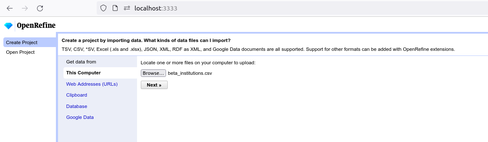
5. Create a new column `PhiloBiblon ID`.
	1. Select column `INSID` -> `Edit column ..` -> `Add column based on this column`
    2. Fill form to create new column.
	    * Name: `PhiloBiblon ID`
	    * Language: `Python / Jython`
	    * Expression: `return "BETA insid " + value`
	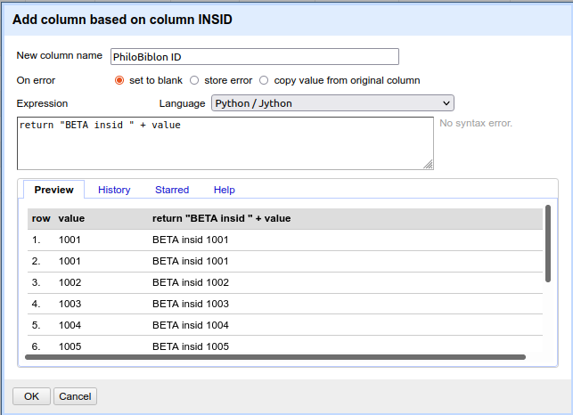
6. Reconcile new column `PhiloBiblon ID` against our Wikibase instance.
	1. Add service: Select column `PhiloBiblon ID` -> `Reconcile` -> `Start reconciling` -> `Add Standard Service...` -> `http://localhost:8000/en/api`
	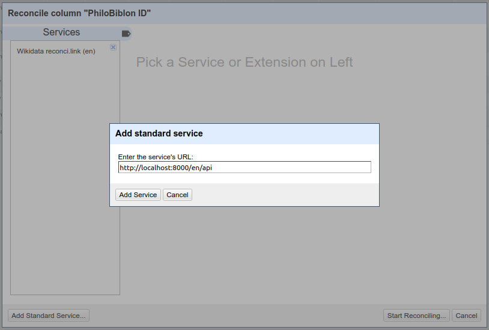
	2. Select recent service added: `Philobiblon local`.
	3. Reconcile column. `PhiloBiblon ID` -> `Reconcile` -> `Start reconciling` -> `PhiloBiblon local (en)` -> `Reconcile against no particular type` -> `Start reconciling...`
	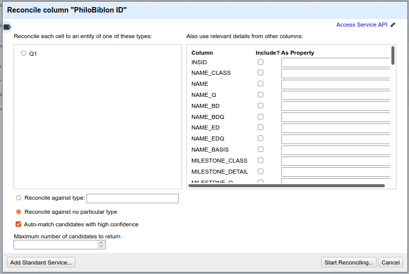
	3. After that we can verify that all values are matched.
7. Create P items for the demo using [Wikibase UI to create properties](http://localhost/wiki/Special:NewProperty).
	1. Create `Name` property of type `String`.
	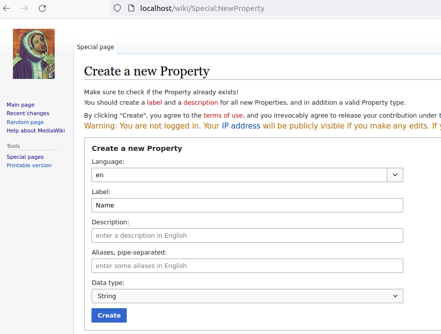
	2. Create `Name class` property of type `Item`.
	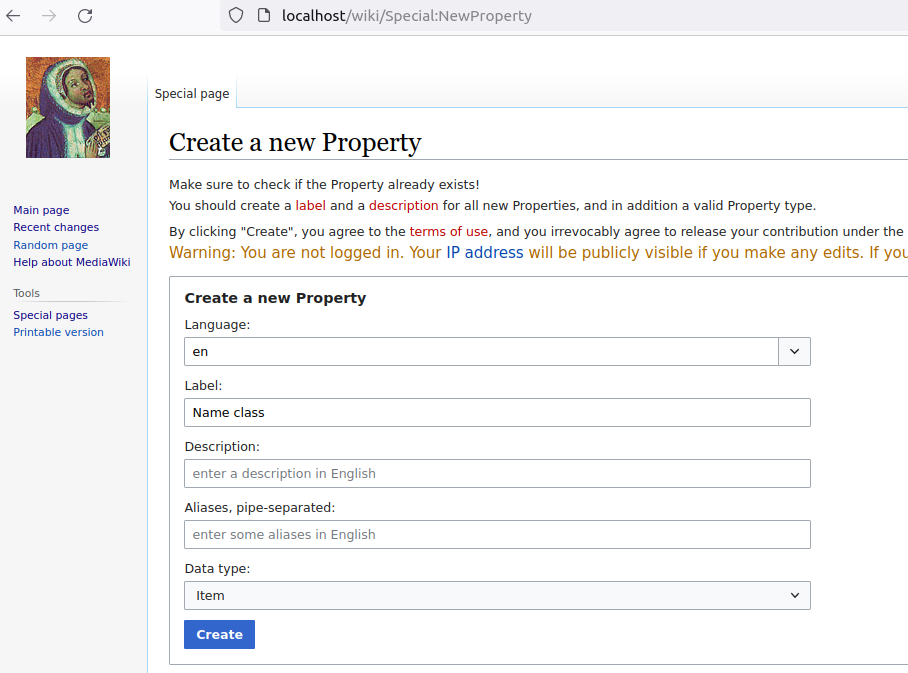
8. Create Q items for the demo using [Wikibase UI to create items](http://localhost/wiki/Special:NewItem).
	1. Create `Name class dataclip` item.
	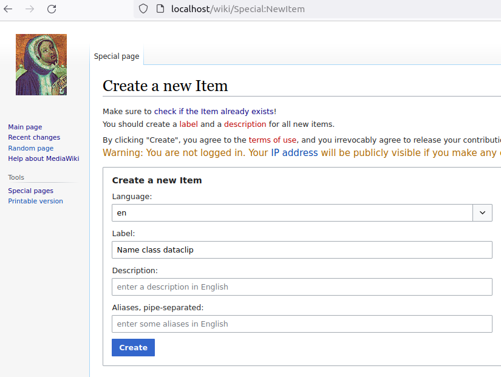
	2. Create `normalizado` item and add statement `instance of` with `Name class dataclip`.
	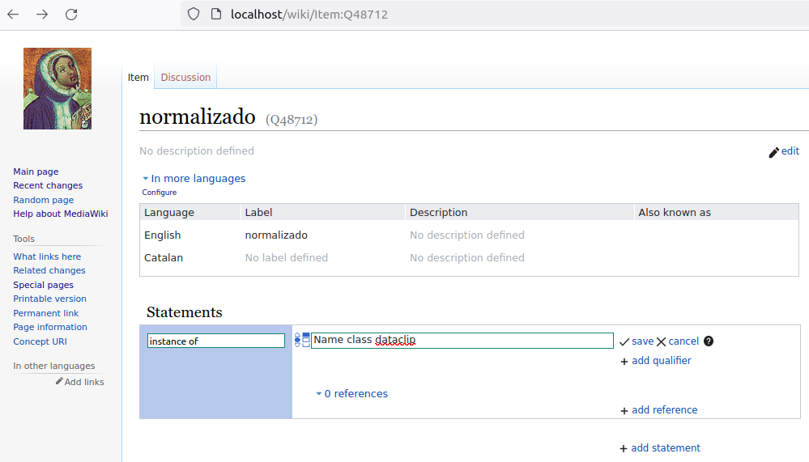
	3. Create `quondam` item and add statement `instance of` with `Name class dataclip`.
	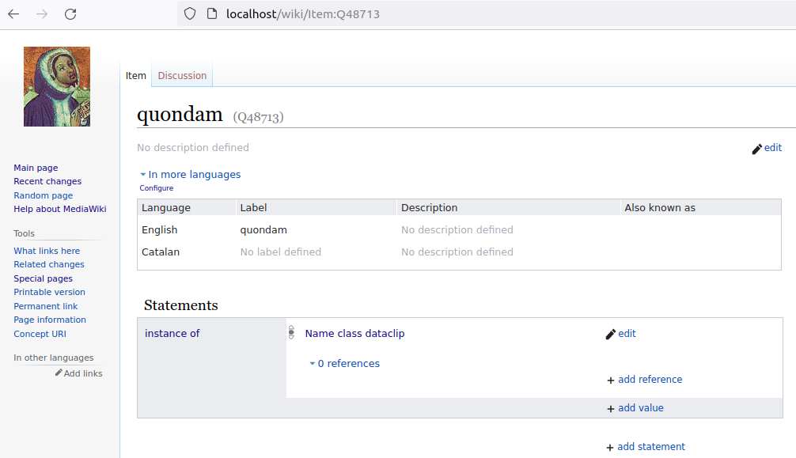
9. Reconcile column `NAME_CLASS` using new Q items created.
	1. Reconcile column. `NAME_CLASS` -> `Reconcile` -> `Start reconciling` -> `PhiloBiblon local (en)` -> `Name class dataclip` -> `Start reconciling...`.
	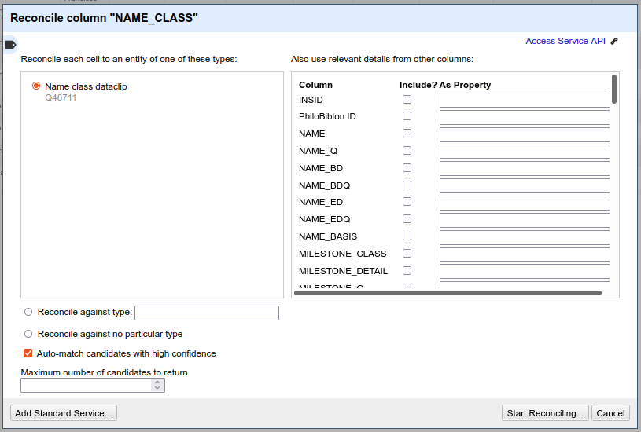
	2. After that we can verify that about 75% of values are matched.
	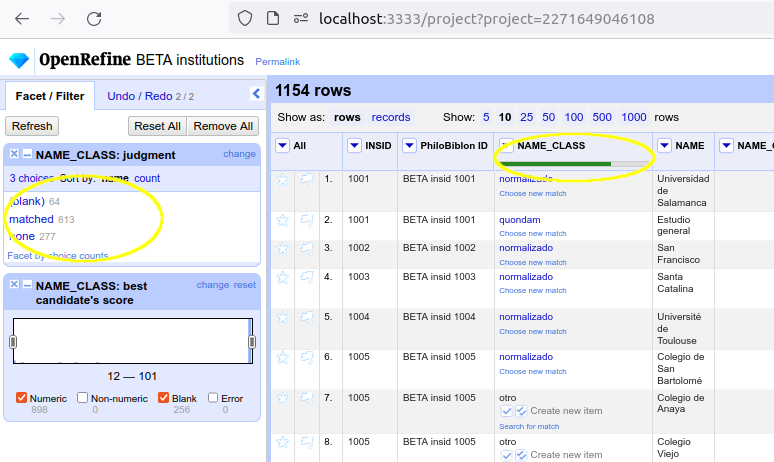
10. Configure our Wikibase sandbox in OpenRefine.
	1. Go to option `Extensions: Wikidata`
	2. Choose `Select Wikibase instance` -> `Add instance`
	3. Copy & paste the content of [local-wikibase-manifest.json](./local-wikibase-manifest.json) in the text area.
	4. And click on `Add Wikibase` button.
	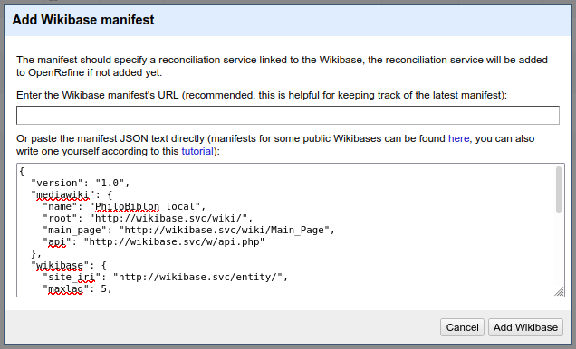
	5. After that we can select `PhiloBiblon local` option.
	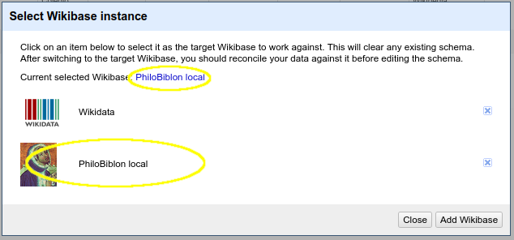
11. Create a Wikibase schema to import our data.
	1. Go to option `Extensions: Wikidata` -> `Edit Wikibase schema`
	2. Create a schema like in the image.
	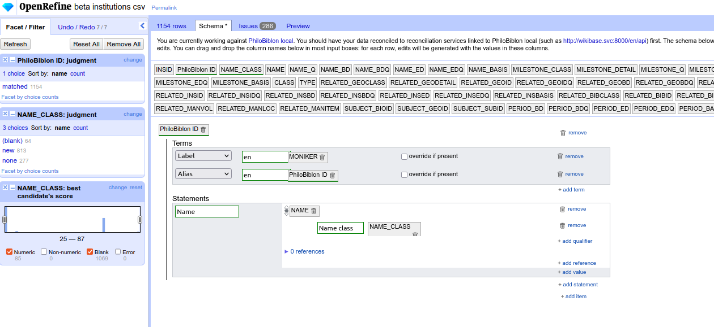
	3. Click on option `Save schema`.
12. Filter rows to simplify the import.
	1. Return to the data tab.
	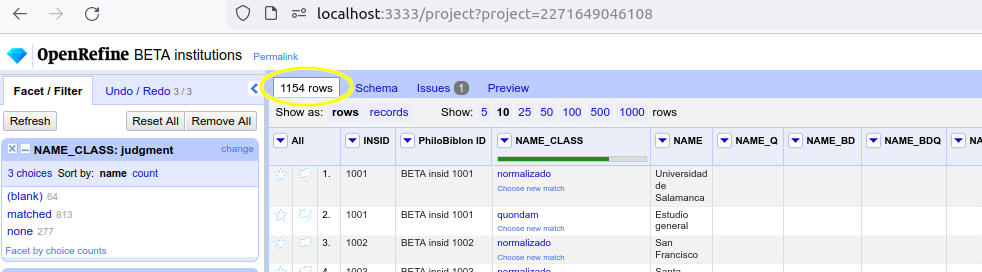
	2. Select column `INSID` -> `Text filter` -> Add `1001` value.
	
13. Export data to QuickStatements format file. Go to option `Extensions: Wikidata` -> `Export to QuickStatements`
14. Import the file using QuickStatements.
	1. Go to QS: `http://quickstatements.svc:8840` (we need to use the service name here `quickstatements.svc`, see  [Login in Quickstatements](#login-in-quickstatements) below).
	2. `Log in` we will be redirected to Wikibase to allow permissions.
	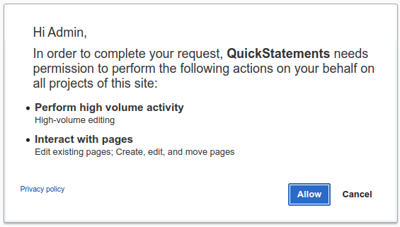
	3. Once authenticated, we create a `New batch`.
		1. Copy & paste the content of the file of step `13` in the text area.
		2. Click on `Import V1 commands` button.
		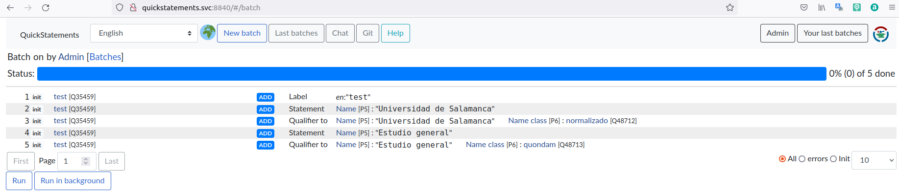
	4. Finally click on `Run` button and verify that the import is ok.
15. Review the item `BETA insid 1001` in Wikibase and you can see your new statements imported.
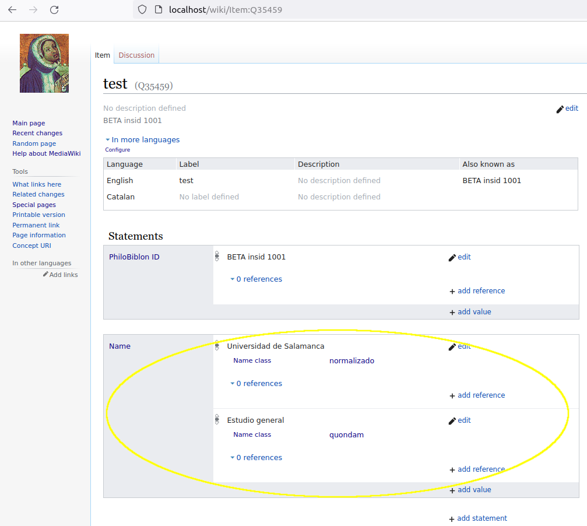
16. Feel free to play with other columns / data :)

## Login in QuickStatements

QuickStatements requires Wikibase authorization, for this it uses the OAuth protocol.

In order to be authorized, OAuth must use the Wikibase and QS service name, **not** the IP or localhost.

This means that to access to QS we should use the name (not the IP/localhost): http://quickstatements.svc:8840

To map the service name (dns name) to localhost, we need to modify the hosts file. 

* In linux:
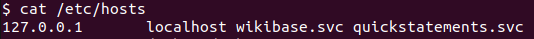
* In windows:
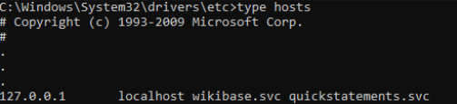

## Other commands

Other commands to work with OpenRefine.

* Stop:
```
docker stop openrefine
```
* Start:
```
docker start openrefine
```
* Remove:
```
docker rm openrefine
```

