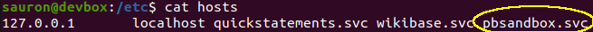
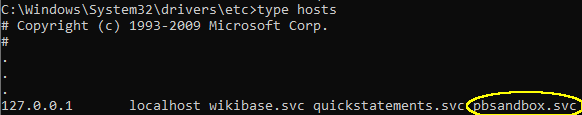
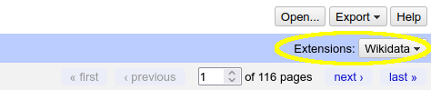
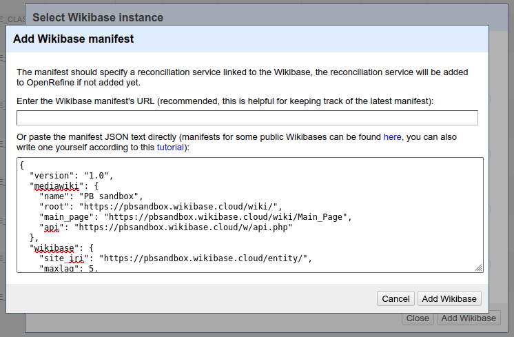
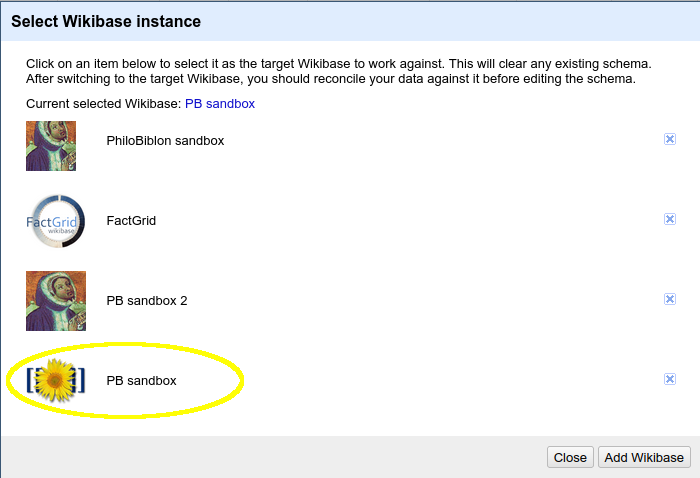

# Configure pbsandbox instance

## Requirements

Install these tools:

1. [Docker](https://docs.docker.com/get-docker/)
2. [Docker Compose](https://docs.docker.com/compose/install/)

## Configure OpenRefine

1. Add local dns name `pbsandbox.svc` for reconciler.
 * In linux:

        

 * In windows:

        

2. Run reconciler
```
cd philobiblon-sandbox/pbsandbox
docker-compose up -d
```

3. Configure our Wikibase sandbox in OpenRefine.
        1. Go to option `Extensions: Wikidata`
        

        2. Choose `Select Wikibase instance` -> `Add instance`
        3. Copy & paste the content of [pbsandbox-manifest.json](./pbsandbox-manifest.json) in the text area.
        4. And click on `Add Wikibase` button.
        

        5. After that we can select `PB sandbox` option.
        

## Other commands

* Stop reconciler:
```
docker-compose stop
```
* Start again:
```
docker-compose up -d
```
* Remove:
```
docker-compose down
```
